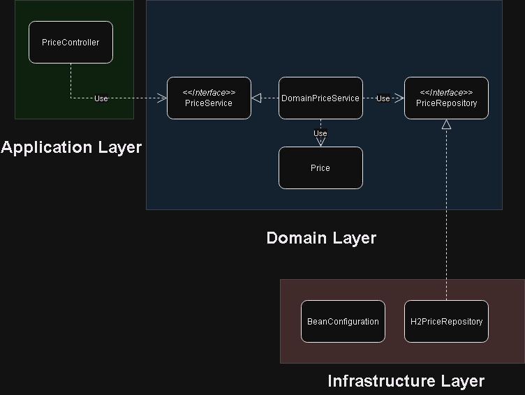

# Price Microservice
> Microservice application using SpringBoot providing a REST endpoint to query price info for a brand, product and date in an ecommerce company DB.

## Table of Contents
* [General Info](#general-information)
* [Technologies Used](#technologies-used)
* [Features](#features)
* [Basic Layers Schema](#basic-layers-schema)
* [Setup](#setup)
* [Usage](#usage)
* [Project Status](#project-status)
* [Room for Improvement](#room-for-improvement)

## General Information
We are going to have an in memory DB (H2) to store a PRICES table with the following fields:

- BRAND_ID: foreign key to a brand of the company (For example: "1 = ZARA").
- START_DATE , END_DATE: range of dates on which the price applies for a rate.
- PRICE_LIST: Id of the rate that can be applied.
- PRODUCT_ID: Id of the product.
- PRIORITY: Used when there is more that one price for a search. If there are two (or more) rates for a rate range we use the one with higher priority (higher numeric value).
- PRICE: final sale price.
- CURR: currency ISO.

Our REST endpoint will provide a response based on the following:
- Input parameters: date, product ID and brand ID.
- Output Data: product ID, brand ID, rate ID to be applied, range of dates on which price applies for the rate and final sale price.

## Technologies Used
TODO

## Features
TODO

## Basic Layers Schema

## Setup
TODO

## Usage
TODO

## Room for Improvement
TODO

## Project Status
Project is: _in progress_
